# Documento de Diseño — Dashboard UI

## Resumen

Este documento describe el diseño técnico del Dashboard UI de la plataforma DYLO HR. El dashboard reemplaza el placeholder actual `DashboardPage` con un layout de tres paneles (sidebar izquierdo colapsable, área principal scrollable, sidebar derecho fijo) que muestra información relevante del empleado: solicitudes, noticias, convenios, calendario, eventos y más.

La implementación usa React 19 + TypeScript estricto + Tailwind CSS v4 + Zustand, sin dependencias adicionales. Todos los datos son mock por ahora, organizados en archivos separados con interfaces tipadas para facilitar la migración futura a API.

El diseño incluye dos tipos de carrusel: un **Carrusel_Bienvenida** con auto-rotación (4s), navegación por flechas con índice circular, y pausa tras interacción manual (8s); y un **Carrusel_Horizontal** tipo marquee/ticker para aniversarios y cumpleaños que se activa automáticamente cuando los nombres exceden el ancho del contenedor, con pausa en hover.

---

## Arquitectura

### Diagrama de Componentes

```mermaid
graph TD
    subgraph DashboardPage
        DL[DashboardLayout]
        DL --> SB[Sidebar]
        DL --> MA[MainArea]
        DL --> RS[RightSidebar]

        SB --> SBNav[SidebarNavItem]
        SB --> SBFooter[SidebarFooter]

        MA --> WH[WelcomeHeader]
        MA --> TB[TopBar]
        MA --> RC[RequestCards]
        RC --> SC[RequestCard x3]
        MA --> NC[NewsCarousel]
        MA --> WB[WelcomeBar]
        MA --> CV[ConveniosGrid]
        CV --> CC[ConvenioCard x6]

        RS --> AW[AttentionWidget]
        RS --> CW[CalendarWidget]
        RS --> EW[EventsWidget]
        RS --> ANW[AnniversariesWidget]
        RS --> BW[BirthdaysWidget]
        RS --> TW[ToolsWidget]
    end

    subgraph Shared["Componentes Reutilizables"]
        Card
        Button
        Badge
        Avatar
        MarqueeText
    end

    subgraph State["Estado"]
        AS[useAuthStore]
        SS[useSidebarStore]
    end

    subgraph MockData["Datos Mock"]
        MD1[solicitudes.mock.ts]
        MD2[noticias.mock.ts]
        MD3[calendario.mock.ts]
        MD4[eventos.mock.ts]
        MD5[aniversarios.mock.ts]
        MD6[cumpleanos.mock.ts]
        MD7[convenios.mock.ts]
        MD8[herramientas.mock.ts]
        MD9[atencion.mock.ts]
        MD10[bienvenida.mock.ts]
        MD11[sidebar.mock.ts]
    end

    SC --> Card
    CC --> Card
    AW --> Card
    WB --> Badge
    CW --> Avatar
    TB --> Button
    TW --> Button
    EW --> Button

    WH --> AS
    WB --> MD10
    ANW --> MarqueeText
    BW --> MarqueeText
    SB --> SS
    RC --> MD1
    NC --> MD2
    CW --> MD3
    EW --> MD4
    ANW --> MD5
    BW --> MD6
    CV --> MD7
    TW --> MD8
    AW --> MD9
    SB --> MD11
```



### Decisiones de Arquitectura

1. **Layout con CSS Grid**: El layout principal usa `grid-template-columns` de Tailwind para los tres paneles. Esto permite controlar el ancho del sidebar colapsado/expandido con transiciones CSS sin JavaScript de layout.

2. **Zustand para estado del sidebar**: Se crea un store `useSidebarStore` mínimo (collapsed: boolean, toggle) separado del auth store. Zustand ya es dependencia del proyecto y es la solución más ligera.

3. **Carruseles sin dependencias externas**: Tanto el carrusel de noticias como el carrusel de bienvenida se implementan con `useState` para el índice activo y `transform: translateX()` con transición CSS. El carrusel de bienvenida agrega auto-rotación con `useEffect` + `setInterval` y navegación por flechas con lógica de índice circular (`(i+1) % N`, `(i-1+N) % N`). No se necesita librería externa.

4. **Marquee horizontal con CSS puro**: El desplazamiento tipo ticker para aniversarios/cumpleaños se implementa con `@keyframes marquee` en CSS y `animation-play-state` para pausa en hover. La detección de overflow usa `useRef` + `useEffect` comparando `scrollWidth` vs `clientWidth` del contenedor. Se encapsula en un componente reutilizable `MarqueeText`.

5. **Mock data con interfaces exportadas**: Cada archivo mock exporta tanto la interfaz TypeScript como los datos. Los componentes importan la interfaz para tipado y los datos para renderizado. Cuando se conecte la API, solo se reemplaza la fuente de datos.

6. **Componentes reutilizables genéricos**: `Card`, `Button`, `Badge`, `Avatar` y `MarqueeText` se diseñan con props de estilo configurables usando Tailwind classes, sin acoplar a un caso de uso específico.

---

## Componentes e Interfaces

### Estructura de Archivos

```
src/
├── components/
│   ├── ui/                          # Componentes reutilizables
│   │   ├── Card.tsx
│   │   ├── Button.tsx
│   │   ├── Badge.tsx
│   │   ├── Avatar.tsx
│   │   └── MarqueeText.tsx
│   └── dashboard/                   # Componentes del dashboard
│       ├── DashboardLayout.tsx
│       ├── Sidebar.tsx
│       ├── SidebarNavItem.tsx
│       ├── TopBar.tsx
│       ├── WelcomeHeader.tsx
│       ├── RequestCards.tsx
│       ├── NewsCarousel.tsx
│       ├── WelcomeBar.tsx
│       ├── ConveniosGrid.tsx
│       ├── ConvenioCard.tsx
│       ├── RightSidebar.tsx
│       ├── AttentionWidget.tsx
│       ├── CalendarWidget.tsx
│       ├── EventsWidget.tsx
│       ├── AnniversariesWidget.tsx
│       ├── BirthdaysWidget.tsx
│       └── ToolsWidget.tsx
├── mocks/
│   └── dashboard/
│       ├── solicitudes.mock.ts
│       ├── noticias.mock.ts
│       ├── calendario.mock.ts
│       ├── eventos.mock.ts
│       ├── aniversarios.mock.ts
│       ├── cumpleanos.mock.ts
│       ├── convenios.mock.ts
│       ├── herramientas.mock.ts
│       ├── atencion.mock.ts
│       ├── bienvenida.mock.ts
│       └── sidebar.mock.ts
├── stores/
│   ├── useAuthStore.ts              # Existente
│   └── useSidebarStore.ts           # Nuevo
└── types/
    └── dashboard.types.ts           # Tipos compartidos del dashboard
```

### Componentes Reutilizables (ui/)

#### Card

```typescript
interface CardProps {
  children: React.ReactNode;
  className?: string;
  hoverClassName?: string;
  onClick?: () => void;
}
```

Contenedor genérico con fondo, bordes redondeados, padding y hover state opcional. Usa `className` para personalización y `hoverClassName` para el efecto hover (ej: `hover:bg-[#E7E7E7]`).

#### Button

```typescript
interface ButtonProps {
  children: React.ReactNode;
  variant: 'orange' | 'teal';
  icon?: React.ReactNode;
  className?: string;
  onClick?: () => void;
}
```

Botón con dos variantes de gradiente:
- `orange`: gradiente `from-dylo-orange to-dylo-orange-darker`, hover `to-dylo-orange-hover-dark`
- `teal`: gradiente `from-dylo-teal-light to-dylo-teal-darker`, hover `from-dylo-teal-hover to-dylo-teal-hover-dark`

#### Badge

```typescript
interface BadgeProps {
  children: React.ReactNode;
  className?: string;
}
```

Etiqueta inline con fondo coloreado, texto pequeño y bordes redondeados.

#### Avatar

```typescript
interface AvatarProps {
  src?: string;
  name: string;
  size?: 'sm' | 'md' | 'lg';
  className?: string;
}
```

Círculo con imagen o iniciales como fallback. Tamaños: `sm` (24px), `md` (32px), `lg` (40px).

#### MarqueeText

```typescript
interface MarqueeTextProps {
  children: React.ReactNode;
  className?: string;
  speed?: number;         // Duración de la animación en segundos (default: 10)
}
```

Componente reutilizable que detecta si su contenido excede el ancho del contenedor. Si hay overflow, aplica una animación CSS `@keyframes marquee` que desplaza el contenido de derecha a izquierda de forma continua. En hover, pausa la animación con `animation-play-state: paused`. Si el contenido cabe, se renderiza estáticamente sin animación.

Implementación interna:
- `useRef` para obtener referencia al contenedor y al contenido
- `useState<boolean>` para `isOverflowing`
- `useEffect` que compara `scrollWidth` vs `clientWidth` y actualiza `isOverflowing`
- `ResizeObserver` opcional para recalcular en resize de ventana
- CSS: `@keyframes marquee { from { transform: translateX(0); } to { transform: translateX(-50%); } }` con contenido duplicado para loop continuo
- Hover: `hover:animation-play-state: paused` (via Tailwind arbitrary o inline style)

### Componentes del Dashboard

#### DashboardLayout

Componente wrapper que define el grid de tres columnas. Lee `collapsed` de `useSidebarStore` para ajustar el ancho de la primera columna.

```typescript
// Layout grid: sidebar | main | right-sidebar
// Expandido: 240px | 1fr | 300px
// Colapsado: 64px  | 1fr | 300px
```

#### Sidebar

Panel izquierdo con fondo `#1a1a1a`. Contiene:
- Logo DYLO (completo o reducido según estado)
- Lista de `SidebarNavItem` con ícono + texto (o solo ícono)
- Enlace "Universidad DYLO" con ícono naranja
- Footer con íconos sociales
- Botón "Ocultar" / ícono hamburguesa para toggle

```typescript
interface SidebarNavItemProps {
  icon: React.ReactNode;
  label: string;
  isActive?: boolean;
  collapsed: boolean;
}
```

#### NewsCarousel

Implementación con estado local:

```typescript
const [activeIndex, setActiveIndex] = useState(0);
// Render: contenedor con overflow-hidden
// Slides: flex con transform translateX(-activeIndex * 100%)
// Dots: map sobre slides, onClick setActiveIndex
```

Transición CSS: `transition-transform duration-300 ease-in-out`.

#### WelcomeBar (Carrusel_Bienvenida)

Barra de bienvenida con carrusel rotativo de empleados nuevos del mes.

Implementación con estado local:

```typescript
interface WelcomeBarProps {
  data?: WelcomeData[];   // Opcional, default desde mock
}

const [activeIndex, setActiveIndex] = useState(0);
const [isPaused, setIsPaused] = useState(false);
const pauseTimeoutRef = useRef<ReturnType<typeof setTimeout> | null>(null);

// Auto-rotación cada 4s (o 8s tras interacción manual)
useEffect(() => {
  if (data.length <= 1) return; // Sin rotación para entrada única
  const interval = setInterval(() => {
    if (!isPaused) {
      setActiveIndex((prev) => (prev + 1) % data.length);
    }
  }, isPaused ? 8000 : 4000);
  return () => clearInterval(interval);
}, [data.length, isPaused]);

// Navegación circular
const goNext = () => {
  setActiveIndex((prev) => (prev + 1) % data.length);
  pauseAutoRotation();
};
const goPrev = () => {
  setActiveIndex((prev) => (prev - 1 + data.length) % data.length);
  pauseAutoRotation();
};

// Pausa temporal tras interacción manual
const pauseAutoRotation = () => {
  setIsPaused(true);
  if (pauseTimeoutRef.current) clearTimeout(pauseTimeoutRef.current);
  pauseTimeoutRef.current = setTimeout(() => setIsPaused(false), 8000);
};
```

Renderizado:
- Contenedor `overflow-hidden` con fondo `#1a1a1a`
- Ícono de ola + texto "Bienvenidos"
- Zona central: nombre del empleado + `Badge` con rol, con transición `opacity` o `translateX`
- Flechas izquierda/derecha (`LuChevronLeft`, `LuChevronRight`) visibles solo cuando `data.length > 1`
- Cuando `data.length === 1`: renderizado estático sin flechas

#### CalendarWidget
- Header: mes/año + flechas de navegación (cambian la semana visible)
- Grilla 7 columnas (Lun-Dom) con fecha
- Día actual resaltado con `bg-dylo-orange rounded-full`
- Pestañas de filtro (Vacaciones/Home Office/Incapacidad)
- Lista de avatares de personas ausentes + conteo

#### AnniversariesWidget / BirthdaysWidget (Carrusel_Horizontal)

Ambos widgets comparten la misma estructura: encabezado con ícono + título, y lista de nombres separados por `|`. La diferencia es el ícono (fiesta vs pastel) y la fuente de datos.

Implementación del marquee:
- Los nombres se renderizan dentro de un componente `MarqueeText`
- `MarqueeText` detecta automáticamente si el contenido excede el ancho del contenedor
- Si hay overflow: activa animación CSS marquee (desplazamiento continuo de derecha a izquierda)
- Si no hay overflow: renderizado estático sin animación
- Hover sobre el texto en movimiento pausa la animación
- Al retirar el cursor, la animación reanuda desde la posición actual

---

## Modelos de Datos

### Tipos Compartidos (`types/dashboard.types.ts`)

```typescript
/** Tarjeta de solicitud (Vacaciones, Cita Médica, Home Office) */
export interface RequestCardData {
  id: string;
  icon: string;           // Nombre del ícono (se mapea a SVG inline)
  label: string;          // "Vacaciones", "Cita Médica", "Home Office"
  sublabel: string;       // "Disponibles", "Utilizados"
  count: number;          // Cantidad de días
  unit: string;           // "días"
}

/** Slide de noticia del carrusel */
export interface NewsSlide {
  id: string;
  title: string;
  content: string;
  imageUrl: string;
}

/** Datos de bienvenida del empleado */
export interface WelcomeData {
  employeeName: string;
  role: string;
}

/** Categoría de convenio */
export interface ConvenioCategory {
  id: string;
  name: string;           // "Restaurantes", "Cuidado Personal", etc.
  imageUrl: string;       // URL de imagen de fondo
}

/** Alerta de atención */
export interface AttentionAlert {
  id: string;
  message: string;        // "Evaluación pendiente — vence hoy"
  linkText: string;       // "Ver >"
}

/** Día del calendario */
export interface CalendarDay {
  date: number;
  dayOfWeek: string;      // "Lun", "Mar", etc.
  isToday: boolean;
}

/** Tipo de ausencia para filtro del calendario */
export type AbsenceType = 'vacaciones' | 'homeOffice' | 'incapacidad';

/** Persona ausente */
export interface AbsentPerson {
  id: string;
  name: string;
  avatarUrl?: string;
  absenceType: AbsenceType;
}

/** Datos del calendario semanal */
export interface CalendarWeekData {
  monthYear: string;      // "Marzo 2026"
  days: CalendarDay[];
  absentPeople: AbsentPerson[];
}

/** Evento próximo */
export interface UpcomingEvent {
  id: string;
  day: number;
  month: string;          // "Mar", "Abr"
  name: string;           // "Capacitación OPS"
}

/** Persona con aniversario o cumpleaños */
export interface CelebrationPerson {
  id: string;
  name: string;
}

/** Herramienta comercial */
export interface CommercialTool {
  id: string;
  icon: string;
  label: string;          // "Presentaciones", "Tarifario"
}

/** Ítem de navegación del sidebar */
export interface SidebarNavItemData {
  id: string;
  icon: string;
  label: string;
  path: string;
  isActive?: boolean;
}
```

### Store del Sidebar (`stores/useSidebarStore.ts`)

```typescript
import { create } from 'zustand';

interface SidebarState {
  collapsed: boolean;
  toggle: () => void;
}

export const useSidebarStore = create<SidebarState>((set) => ({
  collapsed: false,
  toggle: () => set((state) => ({ collapsed: !state.collapsed })),
}));
```

### Estructura de Archivos Mock

Cada archivo mock sigue el patrón:

```typescript
// mocks/dashboard/solicitudes.mock.ts
import type { RequestCardData } from '../../types/dashboard.types';

export const solicitudesMock: RequestCardData[] = [
  { id: '1', icon: 'palm-tree', label: 'Vacaciones', sublabel: 'Disponibles', count: 7, unit: 'días' },
  { id: '2', icon: 'stethoscope', label: 'Cita Médica', sublabel: 'Utilizados', count: 2, unit: 'días' },
  { id: '3', icon: 'home', label: 'Home Office', sublabel: 'Utilizados', count: 4, unit: 'días' },
];
```

El archivo `bienvenida.mock.ts` ahora exporta un **array** de `WelcomeData` para soportar el carrusel de bienvenida:

```typescript
// mocks/dashboard/bienvenida.mock.ts
import type { WelcomeData } from '../../types/dashboard.types';

export const bienvenidaMock: WelcomeData[] = [
  { employeeName: 'Oswaldo González', role: 'Operations executive' },
  { employeeName: 'María López', role: 'Software engineer' },
  { employeeName: 'Carlos Ruiz', role: 'Product designer' },
];
```


---

## Propiedades de Correctitud

*Una propiedad es una característica o comportamiento que debe mantenerse verdadero en todas las ejecuciones válidas de un sistema — esencialmente, una declaración formal sobre lo que el sistema debe hacer. Las propiedades sirven como puente entre especificaciones legibles por humanos y garantías de correctitud verificables por máquina.*

### Propiedad 1: RequestCard muestra datos correctamente

*Para cualquier* `RequestCardData` válido con label y count arbitrarios, al renderizar un `RequestCard` con esos datos, el output debe contener el texto del label y el valor numérico del count.

**Valida: Requisito 3.4**

### Propiedad 2: NewsSlide muestra título, contenido e imagen

*Para cualquier* `NewsSlide` válido con título, contenido e imageUrl arbitrarios, al renderizar el slide del carrusel, el output debe contener el título, el texto del contenido y un elemento imagen con el src correspondiente.

**Valida: Requisito 5.2**

### Propiedad 3: Cantidad de puntos de paginación igual a cantidad de slides

*Para cualquier* array de `NewsSlide[]` de longitud N (donde N ≥ 1), al renderizar el `NewsCarousel`, la cantidad de puntos de paginación debe ser exactamente N.

**Valida: Requisito 5.3**

### Propiedad 4: Navegación del carrusel por punto de paginación

*Para cualquier* array de `NewsSlide[]` de longitud N y cualquier índice válido i en [0, N), al hacer clic en el punto de paginación i, el slide activo debe ser el slide en posición i.

**Valida: Requisito 5.4**

### Propiedad 5: WelcomeBar carrusel muestra una entrada a la vez

*Para cualquier* array de `WelcomeData[]` de longitud N ≥ 1 y cualquier índice activo i en [0, N), al renderizar el `WelcomeBar` con ese array, el output debe contener exactamente el nombre y el rol de la entrada en posición i, y no debe contener el nombre de ninguna otra entrada.

**Valida: Requisito 6.2**

### Propiedad 6: ConvenioCard muestra nombre de categoría

*Para cualquier* `ConvenioCategory` válido con nombre arbitrario, al renderizar un `ConvenioCard`, el output debe contener el texto del nombre de la categoría.

**Valida: Requisito 7.3**

### Propiedad 7: CalendarWidget renderiza datos de la semana completa

*Para cualquier* `CalendarWeekData` válido con monthYear y un array de 7 `CalendarDay`, al renderizar el `CalendarWidget`, el output debe contener el texto de monthYear en el encabezado y las 7 fechas con sus etiquetas de día de la semana.

**Valida: Requisitos 9.1, 9.2**

### Propiedad 8: CalendarWidget resalta el día actual

*Para cualquier* `CalendarWeekData` donde exactamente un `CalendarDay` tiene `isToday=true`, al renderizar el `CalendarWidget`, solo ese día debe tener la clase de resaltado naranja (círculo naranja).

**Valida: Requisito 9.3**

### Propiedad 9: Filtro del calendario muestra conteo correcto de ausentes

*Para cualquier* array de `AbsentPerson[]` con tipos de ausencia mixtos y cualquier `AbsenceType` seleccionado como filtro, el `CalendarWidget` debe mostrar un conteo igual a la cantidad de personas cuyo `absenceType` coincide con el filtro activo.

**Valida: Requisito 9.5**

### Propiedad 10: Eventos se muestran en formato correcto

*Para cualquier* `UpcomingEvent` válido con day, month y name arbitrarios, al renderizar el evento, el output debe contener el texto en formato "{day} {month} — {name}".

**Valida: Requisito 10.2**

### Propiedad 11: Nombres de celebraciones se unen con separador

*Para cualquier* array de `CelebrationPerson[]` de longitud N ≥ 1, al renderizar la lista (ya sea aniversarios o cumpleaños), los nombres deben aparecer unidos por el separador "|".

**Valida: Requisitos 11.1, 11.2**

### Propiedad 12: Navegación circular del carrusel de bienvenida

*Para cualquier* array de `WelcomeData[]` de longitud N ≥ 2 y cualquier índice activo i en [0, N), al hacer clic en la flecha derecha el índice activo debe ser `(i + 1) % N`, y al hacer clic en la flecha izquierda el índice activo debe ser `(i - 1 + N) % N`.

**Valida: Requisitos 6.4, 6.5, 6.6**

### Propiedad 13: Auto-rotación del carrusel de bienvenida avanza el índice

*Para cualquier* array de `WelcomeData[]` de longitud N ≥ 2 y cualquier índice activo i en [0, N), después de 4 segundos sin interacción manual, el índice activo debe avanzar a `(i + 1) % N`.

**Valida: Requisito 6.3**

---

## Manejo de Errores

| Escenario | Estrategia |
|---|---|
| Auth store sin usuario (`user === null`) | El `ProtectedRoute` existente redirige a `/login`. El dashboard no se renderiza sin autenticación. |
| Datos mock con arrays vacíos | Cada sección muestra un estado vacío graceful (no renderiza la sección o muestra mensaje "Sin datos"). |
| Imagen de convenio no carga | `ConvenioCard` usa un fondo de color sólido como fallback via `onError` en el ``. |
| Imagen de avatar no carga | `Avatar` muestra las iniciales del nombre como fallback (ya diseñado en la interfaz). |
| Índice del carrusel fuera de rango | `NewsCarousel` clampea el índice a `[0, slides.length - 1]` en el handler de click. |
| Carrusel de bienvenida con array vacío | `WelcomeBar` no renderiza la barra si el array está vacío. |
| Carrusel de bienvenida con una sola entrada | `WelcomeBar` renderiza estáticamente sin flechas ni auto-rotación. |
| Contenido de marquee no excede contenedor | `MarqueeText` renderiza estáticamente sin animación. |
| Semana del calendario sin datos | `CalendarWidget` muestra la grilla vacía sin avatares ni conteo. |

---

## Estrategia de Testing

### Enfoque Dual

El dashboard se testea con una combinación de tests unitarios (ejemplos específicos) y tests de propiedades (verificación universal).

### Tests Unitarios (Vitest + React Testing Library)

Tests de ejemplo para verificar:
- Layout de 3 paneles renderiza correctamente (Req 1.1)
- Sidebar toggle: expandido → colapsado → expandido (Req 2.1-2.3)
- Menú del sidebar muestra los 9 ítems (Req 2.4)
- Mensaje de bienvenida interpola nombre del auth store (Req 3.1)
- Botón "Checar entrada" tiene gradiente teal correcto (Req 4.1)
- Pestañas de filtro del calendario (3 tabs) (Req 9.4)
- Botón variante orange y teal aplican clases correctas (Req 13.3)
- Gradientes DYLO usan variables del tema (Req 15.1, 15.2)
- WelcomeBar con una sola entrada: sin flechas de navegación (Req 6.8)
- WelcomeBar pausa auto-rotación 8s tras interacción manual (Req 6.7)
- MarqueeText activa animación cuando contenido excede contenedor (Req 11.3, 11.4)
- MarqueeText pausa animación en hover (Req 11.6)
- MarqueeText estático cuando contenido cabe en contenedor (Req 11.8)

### Tests de Propiedades (fast-check + Vitest)

Librería: **fast-check** — la librería de PBT más madura para TypeScript/JavaScript.

Configuración: mínimo 100 iteraciones por test de propiedad.

Cada test de propiedad referencia su propiedad del documento de diseño:

| Tag | Propiedad |
|---|---|
| `Feature: dashboard-ui, Property 1: RequestCard data display` | RequestCard muestra label y count para cualquier RequestCardData |
| `Feature: dashboard-ui, Property 2: NewsSlide data display` | NewsSlide muestra título, contenido e imagen |
| `Feature: dashboard-ui, Property 3: Carousel dot count` | Puntos de paginación = cantidad de slides |
| `Feature: dashboard-ui, Property 4: Carousel navigation` | Click en punto i activa slide i |
| `Feature: dashboard-ui, Property 5: WelcomeBar carousel single entry` | WelcomeBar carrusel muestra una entrada a la vez |
| `Feature: dashboard-ui, Property 6: ConvenioCard data display` | ConvenioCard muestra nombre de categoría |
| `Feature: dashboard-ui, Property 7: CalendarWidget week render` | CalendarWidget renderiza monthYear y 7 días |
| `Feature: dashboard-ui, Property 8: CalendarWidget today highlight` | Solo el día con isToday=true tiene resaltado |
| `Feature: dashboard-ui, Property 9: Calendar filter count` | Conteo de ausentes = filtro aplicado correctamente |
| `Feature: dashboard-ui, Property 10: Event format` | Evento muestra "DD Mes — Nombre" |
| `Feature: dashboard-ui, Property 11: Celebration names separator` | Nombres unidos con "\|" |
| `Feature: dashboard-ui, Property 12: WelcomeBar circular navigation` | Navegación circular: derecha = (i+1)%N, izquierda = (i-1+N)%N |
| `Feature: dashboard-ui, Property 13: WelcomeBar auto-rotation` | Auto-rotación avanza índice cada 4s |

### Dependencias de Testing

- `vitest` — test runner (agregar como devDependency)
- `@testing-library/react` — renderizado de componentes React
- `@testing-library/jest-dom` — matchers de DOM
- `fast-check` — generación de datos para property-based testing
- `jsdom` — entorno DOM para Vitest
