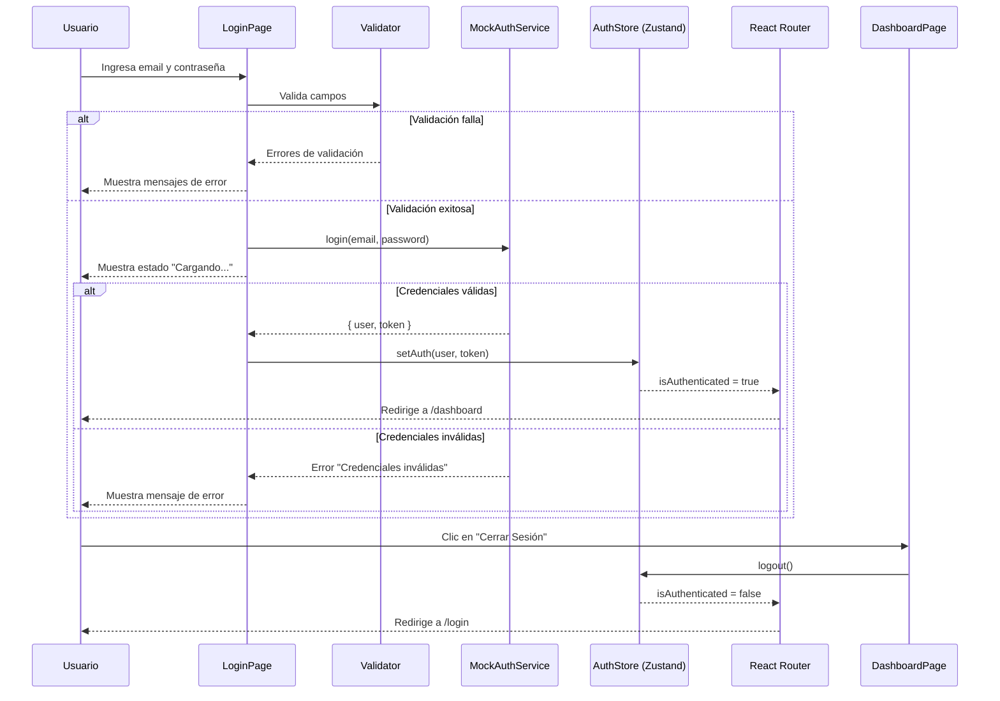
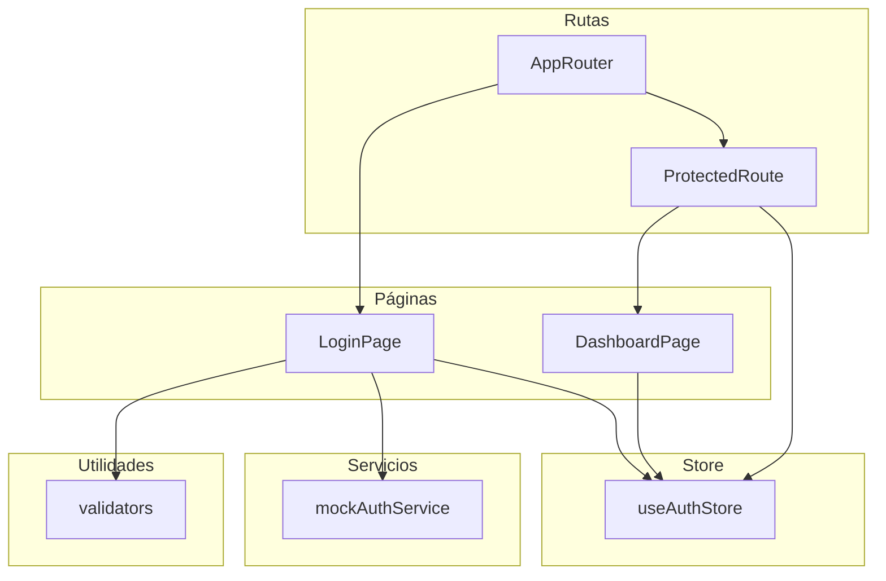

# Documento de Diseño — Página de Login

## Resumen (Overview)

Este documento describe el diseño técnico de la página de login para la plataforma DYLO HR. La implementación abarca la instalación de Tailwind CSS v4, la creación de un formulario de login con validación, un servicio mock de autenticación, la integración con el store de Zustand existente, la redirección condicional de rutas y una página placeholder de dashboard con cierre de sesión.

El diseño se apoya en la infraestructura existente del proyecto: React 19, Vite, TypeScript strict, Zustand 5, React Router 7 y Axios. El backend no está disponible, por lo que toda la autenticación se simula con un módulo mock reemplazable.

---

## Arquitectura (Architecture)

### Diagrama de flujo de autenticación



### Diagrama de componentes



### Estructura de archivos nuevos

```
src/
├── pages/
│   ├── LoginPage.tsx          # Página de login completa
│   └── DashboardPage.tsx      # Página placeholder de dashboard
├── services/
│   └── mockAuthService.ts     # Servicio mock de autenticación
└── utils/
    └── validators.ts          # Funciones de validación del formulario
```

### Decisiones de diseño

1. **Tailwind CSS v4**: Se usa la versión 4 con el plugin `@tailwindcss/vite` para integración nativa con Vite, sin necesidad de `tailwind.config.js` ni `postcss.config.js`.
2. **Validación pura**: Las funciones de validación son puras (sin side effects), reciben datos y devuelven errores. Esto facilita el testing y la reutilización.
3. **Mock como módulo independiente**: `mockAuthService.ts` expone la misma interfaz que tendrá el servicio real, permitiendo un reemplazo directo cuando el backend esté listo.
4. **Sin librería de formularios**: Dado que el formulario es simple (2 campos), se usa `useState` nativo de React en lugar de agregar dependencias como React Hook Form.
5. **Páginas en carpeta `pages/`**: Se crea una nueva carpeta `pages/` para separar las páginas de los componentes de ruta.

---

## Componentes e Interfaces (Components and Interfaces)

### LoginPage (`src/pages/LoginPage.tsx`)

Componente de página que orquesta el formulario de login.

```typescript
// Estado interno del componente
interface LoginPageState {
  email: string;
  password: string;
  errors: ValidationErrors;
  serverError: string | null;
  isLoading: boolean;
}
```

**Responsabilidades:**
- Renderizar el formulario con campos de email y contraseña
- Ejecutar validación al enviar el formulario
- Llamar a `mockAuthService.login()` si la validación pasa
- Invocar `setAuth()` del store en caso de éxito
- Redirigir a `/dashboard` tras login exitoso
- Redirigir a `/dashboard` si el usuario ya está autenticado
- Mostrar errores de validación y del servidor
- Deshabilitar campos y botón durante la carga

### DashboardPage (`src/pages/DashboardPage.tsx`)

Componente placeholder de dashboard.

**Responsabilidades:**
- Mostrar mensaje de bienvenida con el nombre del usuario desde `useAuthStore`
- Renderizar botón "Cerrar Sesión"
- Invocar `logout()` del store al hacer clic en el botón
- Redirigir a `/login` tras el logout

### mockAuthService (`src/services/mockAuthService.ts`)

Módulo que simula la respuesta del backend de autenticación.

```typescript
interface AuthResponse {
  user: {
    id: string;
    email: string;
    name: string;
    role: string;
  };
  token: string;
}

interface AuthService {
  login(email: string, password: string): Promise<AuthResponse>;
}
```

**Comportamiento:**
- Si `email === "admin@dylo.com"` y `password === "admin123"`, devuelve un `AuthResponse` con datos del usuario y un token JWT simulado tras un retardo de 500–1000ms.
- En cualquier otro caso, lanza un `Error("Credenciales inválidas")` tras el mismo retardo.

### validators (`src/utils/validators.ts`)

Funciones puras de validación.

```typescript
interface ValidationErrors {
  email?: string;
  password?: string;
}

function validateLoginForm(email: string, password: string): ValidationErrors;
function validateEmail(email: string): string | undefined;
function validatePassword(password: string): string | undefined;
```

**Reglas de validación:**
- `email` vacío → `"El correo electrónico es obligatorio"`
- `email` con formato inválido (no pasa regex de email) → `"El formato del correo electrónico no es válido"`
- `password` vacío → `"La contraseña es obligatoria"`
- Si no hay errores, retorna un objeto vacío `{}`

### AppRouter actualizado (`src/routes/AppRouter.tsx`)

Se reemplazan los componentes placeholder inline por imports de `LoginPage` y `DashboardPage`.

---

## Modelos de Datos (Data Models)

### User (existente en `useAuthStore.ts`)

```typescript
interface User {
  id: string;
  email: string;
  name: string;
  role: string;
}
```

### AuthState (existente en `useAuthStore.ts`)

```typescript
interface AuthState {
  user: User | null;
  token: string | null;
  isAuthenticated: boolean;
  setAuth: (user: User, token: string) => void;
  logout: () => void;
}
```

### ValidationErrors (nuevo)

```typescript
interface ValidationErrors {
  email?: string;
  password?: string;
}
```

### AuthResponse (nuevo)

```typescript
interface AuthResponse {
  user: User;
  token: string;
}
```

No se requieren modelos de datos adicionales. El store de Zustand existente ya cubre el estado de autenticación. Los nuevos tipos (`ValidationErrors`, `AuthResponse`) son interfaces ligeras que tipan las respuestas del validador y del servicio mock.

---


## Propiedades de Correctitud (Correctness Properties)

*Una propiedad es una característica o comportamiento que debe mantenerse verdadero en todas las ejecuciones válidas de un sistema — esencialmente, una declaración formal sobre lo que el sistema debe hacer. Las propiedades sirven como puente entre especificaciones legibles por humanos y garantías de correctitud verificables por máquinas.*

### Propiedad 1: Correctitud de validación de email

*Para cualquier* string arbitrario, si el string está vacío, `validateEmail` debe retornar `"El correo electrónico es obligatorio"`. Si el string no está vacío pero no cumple el formato estándar de email, debe retornar `"El formato del correo electrónico no es válido"`. Si el string cumple el formato de email, no debe retornar error.

**Valida: Requisitos 3.1, 3.3**

### Propiedad 2: Credenciales inválidas siempre son rechazadas

*Para cualquier* par de strings (email, password) que no sea exactamente `("admin@dylo.com", "admin123")`, `mockAuthService.login(email, password)` debe lanzar un error con el mensaje `"Credenciales inválidas"`.

**Valida: Requisito 4.2**

### Propiedad 3: Round-trip del store de autenticación

*Para cualquier* objeto User válido y cualquier string token no vacío, llamar a `setAuth(user, token)` debe establecer `isAuthenticated` en `true`, `user` en el objeto proporcionado y `token` en el string proporcionado. Posteriormente, llamar a `logout()` debe restablecer `user` a `null`, `token` a `null` e `isAuthenticated` a `false`.

**Valida: Requisitos 5.2, 5.3**

### Propiedad 4: Mensaje de bienvenida incluye el nombre del usuario

*Para cualquier* objeto User con un nombre arbitrario no vacío, al renderizar `DashboardPage` con ese usuario autenticado en el store, el output renderizado debe contener el nombre del usuario.

**Valida: Requisito 7.1**

---

## Manejo de Errores (Error Handling)

### Errores de validación del formulario

| Condición | Mensaje | Ubicación |
|---|---|---|
| Email vacío | "El correo electrónico es obligatorio" | Junto al campo de email |
| Email con formato inválido | "El formato del correo electrónico no es válido" | Junto al campo de email |
| Contraseña vacía | "La contraseña es obligatoria" | Junto al campo de contraseña |

- Los errores de validación se muestran inline junto a cada campo.
- Los errores se limpian cuando el usuario corrige el campo y reenvía el formulario.
- Si hay errores de validación, el formulario NO invoca al servicio mock.

### Errores del servicio de autenticación

| Condición | Mensaje | Ubicación |
|---|---|---|
| Credenciales inválidas | "Credenciales inválidas" (del servicio) | Parte superior del formulario |
| Error inesperado (red, excepción) | "Ocurrió un error inesperado. Intente nuevamente." | Parte superior del formulario |

- Los errores del servidor se muestran en un banner/alerta en la parte superior del formulario.
- El error del servidor se limpia cuando el usuario intenta enviar el formulario nuevamente.
- Tras un error, los campos y el botón se rehabilitan para permitir un nuevo intento.

### Estados de carga

- Durante la llamada al servicio mock, el botón muestra "Cargando..." y se deshabilita.
- Los campos de email y contraseña se deshabilitan durante la carga.
- Si la llamada falla, se restaura el estado normal del formulario.

---

## Estrategia de Testing (Testing Strategy)

### Librería de testing

- **Vitest** como test runner (compatible con Vite).
- **React Testing Library** para tests de componentes.
- **fast-check** como librería de property-based testing para TypeScript.

### Tests unitarios (example-based)

Tests específicos para casos concretos y edge cases:

- **LoginPage**: Renderiza campos de email, contraseña y botón "Iniciar Sesión". Campo de contraseña tiene `type="password"`. Redirección a `/dashboard` si ya está autenticado.
- **LoginPage — estados de carga**: Botón deshabilitado con texto "Cargando..." durante la petición. Campos deshabilitados durante la carga.
- **LoginPage — errores**: Muestra errores de validación inline. Muestra error del servidor en banner superior. Muestra mensaje genérico ante error inesperado.
- **MockAuthService**: Credenciales válidas retornan `AuthResponse` con estructura correcta. Retardo entre 500-1000ms.
- **DashboardPage**: Renderiza botón "Cerrar Sesión". Clic en botón invoca `logout()`. Redirección a `/login` tras logout.
- **AppRouter**: `/login` renderiza LoginPage. `/dashboard` protegido renderiza DashboardPage. Ruta desconocida redirige a `/login`.

### Tests de propiedades (property-based)

Cada propiedad del documento de diseño se implementa como un test con **fast-check**, con un mínimo de **100 iteraciones** por propiedad.

| Propiedad | Descripción | Tag |
|---|---|---|
| 1 | Correctitud de validación de email | `Feature: login-page, Property 1: Email validation correctness` |
| 2 | Credenciales inválidas siempre rechazadas | `Feature: login-page, Property 2: Invalid credentials always rejected` |
| 3 | Round-trip del store de autenticación | `Feature: login-page, Property 3: Auth store round-trip` |
| 4 | Mensaje de bienvenida incluye nombre | `Feature: login-page, Property 4: Welcome message includes user name` |

### Configuración

- Cada test de propiedad debe ejecutarse con `fc.assert(fc.property(...), { numRuns: 100 })`.
- Cada test debe incluir un comentario con el tag de la propiedad correspondiente.
- Los tests de componentes que requieren React Testing Library usarán `@testing-library/react` con `vitest`.
- Los tests de propiedades de funciones puras (validadores, mock service) no requieren DOM.
