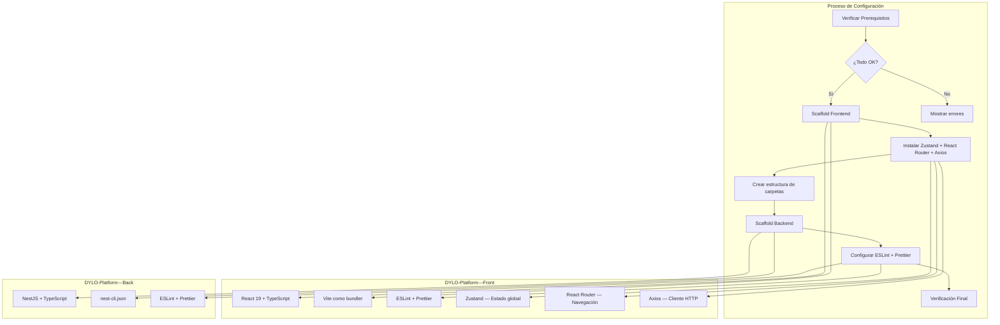

# Documento de Diseño — Configuración del Proyecto DYLO Platform

## Visión General

Este documento describe el diseño técnico para la configuración inicial del proyecto full-stack DYLO Platform. El sistema consta de dos workspaces independientes:

- **DYLO-Platform---Front**: Aplicación React + TypeScript con Vite como bundler, Zustand para estado global, React Router para navegación y Axios como cliente HTTP
- **DYLO-Platform---Back**: API NestJS + TypeScript

El proceso de configuración se divide en fases secuenciales: verificación de prerequisitos, scaffold del frontend, scaffold del backend, y configuración de herramientas de calidad de código. No se utiliza Docker; todo se ejecuta directamente en el entorno local del desarrollador.

### Hallazgos de Investigación

- **Vite**: El template `react-ts` de Vite (`npm create vite@latest -- --template react-ts`) genera la estructura estándar con TypeScript, incluyendo `tsconfig.json`, `vite.config.ts`, `src/App.tsx`, `src/main.tsx` e `index.html`. ([Fuente: Vite docs](https://vite.dev/guide/))
- **NestJS CLI**: El comando `npx @nestjs/cli new` genera un proyecto completo con `app.module.ts`, `app.controller.ts`, `app.service.ts`, `main.ts`, `tsconfig.json` y `nest-cli.json`. Soporta el flag `--strict` para TypeScript estricto. ([Fuente: NestJS docs](https://docs.nestjs.com/cli/overview))
- **ESLint Flat Config**: ESLint 9+ usa flat config (`eslint.config.mjs`) como formato por defecto. Vite ya genera un `eslint.config.js` con el template `react-ts`. NestJS genera `.eslintrc.js` que se debe migrar a flat config para consistencia. ([Fuente: ESLint docs](https://eslint.org/docs/latest/use/configure/configuration-files))
- **Prettier**: Se integra con ESLint mediante `eslint-config-prettier` para desactivar reglas de formato conflictivas. ([Fuente: eslint-config-prettier](https://github.com/prettier/eslint-config-prettier))
- **Zustand**: Librería ligera de estado global para React. No requiere providers ni boilerplate excesivo. Se eligió sobre React Context por su simplicidad, rendimiento (re-renders selectivos) y escalabilidad. ([Fuente: Zustand docs](https://zustand-demo.pmnd.rs/))
- **React Router**: Librería estándar de enrutamiento para React SPA. Se usará `react-router-dom` v6+ con rutas protegidas para el flujo de login. ([Fuente: React Router docs](https://reactrouter.com/))
- **Axios**: Cliente HTTP basado en promesas. Se configurará una instancia base con interceptores para manejar tokens de autenticación y errores globales. ([Fuente: Axios docs](https://axios-http.com/))

## Arquitectura

El proyecto sigue una arquitectura de monorepo con dos workspaces independientes (sin herramienta de monorepo como Turborepo o Nx). Cada workspace tiene su propio `package.json`, configuración de TypeScript, ESLint y Prettier.



### Decisiones de Diseño

1. **Vite sobre CRA**: Create React App está deprecado. Vite es la herramienta recomendada por la documentación oficial de React para nuevos proyectos.
2. **ESLint Flat Config**: Se usa el formato flat config (`eslint.config.mjs`) en ambos proyectos para consistencia y compatibilidad futura con ESLint 9+.
3. **Prettier como formateador independiente**: Prettier se configura como archivo `.prettierrc` separado y se integra con ESLint via `eslint-config-prettier` para evitar conflictos de reglas.
4. **Sin monorepo tooling**: Los dos workspaces son completamente independientes. No se necesita Turborepo, Nx ni workspaces de npm porque cada proyecto tiene su propio ciclo de vida.
5. **NestJS CLI con --strict**: Se usa el flag `--strict` del CLI de NestJS para habilitar TypeScript estricto desde el inicio.
6. **Zustand sobre React Context**: Se eligió Zustand por su API minimalista, re-renders selectivos sin necesidad de `useMemo`/`useCallback`, y porque escala mejor que Context para estado global complejo (auth, UI, datos). No requiere providers envolventes.
7. **React Router para navegación**: Se usa `react-router-dom` v6+ para manejar rutas protegidas (login como primera feature). Permite definir layouts con `Outlet` y guards de autenticación.
8. **Axios sobre fetch nativo**: Se eligió Axios por sus interceptores (para inyectar tokens JWT automáticamente), manejo de errores centralizado, y configuración de instancia base con `baseURL` para el backend.

## Componentes e Interfaces

### 1. Módulo de Verificación de Prerequisitos

Responsable de comprobar que las herramientas necesarias están instaladas y cumplen las versiones mínimas.

```typescript
// Interfaz conceptual del verificador
interface PrerequisiteCheck {
  tool: string;        // "node" | "npm" | "git"
  command: string;     // Comando para obtener versión (e.g., "node --version")
  minVersion: string;  // Versión mínima requerida (e.g., "18.0.0")
}

interface CheckResult {
  tool: string;
  installed: boolean;
  currentVersion: string | null;
  meetsMinimum: boolean;
  minVersion: string;
}

// Función principal
function checkPrerequisites(checks: PrerequisiteCheck[]): CheckResult[];

// Función de comparación de versiones semver
function compareVersions(current: string, minimum: string): boolean;

// Función de parsing de versión desde output de CLI
function parseVersionOutput(output: string): string | null;
```

### 2. Scaffold Frontend (React + Vite + TypeScript)

Utiliza el template oficial de Vite para crear el proyecto React con TypeScript, y luego se instalan las dependencias adicionales (Zustand, React Router, Axios).

```
Comando: npm create vite@latest . -- --template react-ts
Directorio: DYLO-Platform---Front/

Dependencias adicionales:
  npm install zustand react-router-dom axios
```

**Estructura generada + carpetas adicionales:**
```
DYLO-Platform---Front/
├── public/
├── src/
│   ├── routes/
│   │   ├── AppRouter.tsx          # Configuración principal de rutas
│   │   └── ProtectedRoute.tsx     # Guard para rutas protegidas
│   ├── services/
│   │   └── api.ts                 # Instancia de Axios configurada
│   ├── stores/
│   │   └── useAuthStore.ts        # Store de autenticación con Zustand
│   ├── App.tsx
│   ├── App.css
│   ├── main.tsx
│   ├── index.css
│   └── vite-env.d.ts
├── index.html
├── package.json
├── tsconfig.json
├── tsconfig.app.json
├── tsconfig.node.json
├── vite.config.ts
└── eslint.config.js
```

### 2.1 Store de Autenticación (Zustand)

Store base para manejar el estado de autenticación. Se expandirá cuando se implemente el login completo.

```typescript
// src/stores/useAuthStore.ts
import { create } from 'zustand';

interface User {
  id: string;
  email: string;
  name: string;
  role: string;
}

interface AuthState {
  user: User | null;
  token: string | null;
  isAuthenticated: boolean;
  setAuth: (user: User, token: string) => void;
  logout: () => void;
}

export const useAuthStore = create<AuthState>((set) => ({
  user: null,
  token: null,
  isAuthenticated: false,
  setAuth: (user, token) => set({ user, token, isAuthenticated: true }),
  logout: () => set({ user: null, token: null, isAuthenticated: false }),
}));
```

### 2.2 Configuración de Axios

Instancia base de Axios con interceptores para inyectar el token JWT y manejar errores globales.

```typescript
// src/services/api.ts
import axios from 'axios';
import { useAuthStore } from '../stores/useAuthStore';

const API_BASE_URL = import.meta.env.VITE_API_URL || 'http://localhost:3000';

const api = axios.create({
  baseURL: API_BASE_URL,
  headers: {
    'Content-Type': 'application/json',
  },
});

// Interceptor para inyectar token
api.interceptors.request.use((config) => {
  const token = useAuthStore.getState().token;
  if (token) {
    config.headers.Authorization = `Bearer ${token}`;
  }
  return config;
});

// Interceptor para manejar errores (e.g., 401 → logout)
api.interceptors.response.use(
  (response) => response,
  (error) => {
    if (error.response?.status === 401) {
      useAuthStore.getState().logout();
    }
    return Promise.reject(error);
  },
);

export default api;
```

### 2.3 Configuración de React Router

Estructura base de rutas con soporte para rutas protegidas. Login será la primera ruta implementada.

```typescript
// src/routes/ProtectedRoute.tsx
import { Navigate, Outlet } from 'react-router-dom';
import { useAuthStore } from '../stores/useAuthStore';

export const ProtectedRoute = () => {
  const isAuthenticated = useAuthStore((state) => state.isAuthenticated);
  return isAuthenticated ? <Outlet /> : <Navigate to="/login" replace />;
};
```

```typescript
// src/routes/AppRouter.tsx
import { BrowserRouter, Routes, Route, Navigate } from 'react-router-dom';
import { ProtectedRoute } from './ProtectedRoute';

// Placeholder — se reemplazará con páginas reales
const LoginPage = () => <div>Login</div>;
const DashboardPage = () => <div>Dashboard</div>;

export const AppRouter = () => (
  <BrowserRouter>
    <Routes>
      <Route path="/login" element={<LoginPage />} />
      <Route element={<ProtectedRoute />}>
        <Route path="/dashboard" element={<DashboardPage />} />
      </Route>
      <Route path="*" element={<Navigate to="/login" replace />} />
    </Routes>
  </BrowserRouter>
);
```

### 3. Scaffold Backend (NestJS + TypeScript)

Utiliza el CLI oficial de NestJS para crear el proyecto.

```
Comando: npx @nestjs/cli new . --strict --skip-git --package-manager npm
Directorio: DYLO-Platform---Back/
```

**Estructura generada:**
```
DYLO-Platform---Back/
├── src/
│   ├── app.module.ts
│   ├── app.controller.ts
│   ├── app.controller.spec.ts
│   ├── app.service.ts
│   └── main.ts
├── test/
│   ├── app.e2e-spec.ts
│   └── jest-e2e.json
├── package.json
├── tsconfig.json
├── tsconfig.build.json
├── nest-cli.json
└── .eslintrc.js
```

### 4. Configuración de ESLint + Prettier

**Frontend (ya incluido por Vite, se extiende):**
- `eslint.config.js` — generado por Vite, se extiende con `eslint-config-prettier`
- `.prettierrc` — configuración de Prettier

**Backend (se migra a flat config):**
- `eslint.config.mjs` — migrado desde `.eslintrc.js` generado por NestJS
- `.prettierrc` — configuración de Prettier compartida

**Configuración Prettier compartida:**
```json
{
  "semi": true,
  "trailingComma": "all",
  "singleQuote": true,
  "printWidth": 100,
  "tabWidth": 2
}
```

## Modelos de Datos

Este proyecto no tiene modelos de datos persistentes en esta fase. Los datos relevantes son:

### Configuración de Prerequisitos

```typescript
interface ToolRequirement {
  name: string;           // Nombre de la herramienta
  versionCommand: string; // Comando para obtener versión
  versionRegex: RegExp;   // Regex para extraer versión del output
  minMajor: number;       // Versión mayor mínima
  minMinor: number;       // Versión menor mínima
  minPatch: number;       // Versión patch mínima
}

const PREREQUISITES: ToolRequirement[] = [
  {
    name: 'Node.js',
    versionCommand: 'node --version',
    versionRegex: /v(\d+\.\d+\.\d+)/,
    minMajor: 18,
    minMinor: 0,
    minPatch: 0,
  },
  {
    name: 'npm',
    versionCommand: 'npm --version',
    versionRegex: /(\d+\.\d+\.\d+)/,
    minMajor: 9,
    minMinor: 0,
    minPatch: 0,
  },
  {
    name: 'Git',
    versionCommand: 'git --version',
    versionRegex: /(\d+\.\d+\.\d+)/,
    minMajor: 2,
    minMinor: 0,
    minPatch: 0,
  },
];
```

### Configuración de Scripts por Workspace

**Frontend (`package.json` scripts):**
```json
{
  "dev": "vite",
  "build": "tsc -b && vite build",
  "lint": "eslint .",
  "preview": "vite preview",
  "format": "prettier --write \"src/**/*.{ts,tsx,css,html}\""
}
```

**Frontend — dependencias adicionales:**
```json
{
  "dependencies": {
    "zustand": "^5.x",
    "react-router-dom": "^7.x",
    "axios": "^1.x"
  }
}
```

**Backend (`package.json` scripts):**
```json
{
  "start": "nest start",
  "start:dev": "nest start --watch",
  "start:debug": "nest start --debug --watch",
  "start:prod": "node dist/main",
  "build": "nest build",
  "lint": "eslint \"{src,apps,libs,test}/**/*.ts\"",
  "format": "prettier --write \"src/**/*.ts\"",
  "test": "jest",
  "test:watch": "jest --watch",
  "test:cov": "jest --coverage",
  "test:e2e": "jest --config ./test/jest-e2e.json"
}
```


## Propiedades de Correctitud

*Una propiedad es una característica o comportamiento que debe mantenerse verdadero en todas las ejecuciones válidas de un sistema — esencialmente, una declaración formal sobre lo que el sistema debe hacer. Las propiedades sirven como puente entre especificaciones legibles por humanos y garantías de correctitud verificables por máquinas.*

### Propiedad 1: Round-trip de parsing de versiones

*Para cualquier* cadena de versión semver válida (e.g., "v18.3.1", "10.2.0", "git version 2.49.0"), la función `parseVersionOutput` debe extraer correctamente los componentes major, minor y patch, de modo que reconstruir la cadena "major.minor.patch" produzca la versión original.

**Valida: Requisitos 1.1, 1.2, 1.3**

### Propiedad 2: Correctitud de comparación de versiones

*Para cualquier* par de versiones semver (a, b), si a.major > b.major, entonces `compareVersions(a, b)` debe retornar true (a cumple el mínimo b). Además, la comparación debe ser transitiva: si a >= b y b >= c, entonces a >= c.

**Valida: Requisitos 1.1, 1.2, 1.3**

### Propiedad 3: Completitud del reporte de prerequisitos

*Para cualquier* conjunto de resultados de verificación de herramientas (mezcla de éxitos y fallos), el reporte generado debe contener el nombre de cada herramienta y su versión detectada (si fue exitoso) o la versión mínima requerida (si falló).

**Valida: Requisitos 1.4, 1.5**

## Manejo de Errores

### Errores de Verificación de Prerequisitos

| Escenario | Comportamiento |
|---|---|
| Herramienta no instalada | Mostrar mensaje: "[Herramienta] no está instalada. Versión mínima requerida: X.Y.Z" |
| Versión insuficiente | Mostrar mensaje: "[Herramienta] versión X.Y.Z detectada, pero se requiere mínimo A.B.C" |
| Comando falla al ejecutar | Tratar como "no instalada" y mostrar mensaje apropiado |
| Todas las verificaciones pasan | Mostrar resumen con versiones detectadas y continuar |

### Errores de Scaffold

| Escenario | Comportamiento |
|---|---|
| `npm create vite` falla | Mostrar error del comando y abortar el proceso |
| `npx @nestjs/cli new` falla | Mostrar error del comando y abortar el proceso |
| Directorio no vacío (archivos existentes) | Los scaffolds de Vite y NestJS manejan esto internamente; se preservan archivos existentes como `.git` y `.kiro` |
| `npm install` falla | Mostrar error de instalación de dependencias y sugerir verificar conexión a internet |

### Errores de Configuración de Calidad

| Escenario | Comportamiento |
|---|---|
| Instalación de dependencias de ESLint/Prettier falla | Mostrar error y sugerir ejecutar `npm install` manualmente |
| Lint reporta errores en código generado | Indicar que el scaffold generó código con problemas y listar los errores |

## Estrategia de Testing

### Enfoque Dual de Testing

Este proyecto utiliza una combinación de tests unitarios con property-based testing (PBT) para la lógica de verificación de prerequisitos, y tests de integración/smoke para la verificación del scaffold.

### Property-Based Tests (PBT)

**Librería**: [fast-check](https://github.com/dubzzz/fast-check) (TypeScript/JavaScript)

**Configuración**: Mínimo 100 iteraciones por propiedad.

Cada test de propiedad debe estar etiquetado con un comentario referenciando la propiedad del diseño:

| Propiedad | Descripción | Tag |
|---|---|---|
| Propiedad 1 | Round-trip de parsing de versiones | `Feature: project-setup, Property 1: Version parsing round-trip` |
| Propiedad 2 | Correctitud de comparación de versiones | `Feature: project-setup, Property 2: Version comparison correctness` |
| Propiedad 3 | Completitud del reporte de prerequisitos | `Feature: project-setup, Property 3: Prerequisite report completeness` |

### Tests Unitarios (Ejemplo)

- Verificar que `parseVersionOutput("v22.14.0")` retorna `{ major: 22, minor: 14, patch: 0 }`
- Verificar que `parseVersionOutput("invalid")` retorna `null`
- Verificar que `compareVersions("18.0.0", "18.0.0")` retorna `true` (igualdad)

### Tests de Integración / Smoke

| Test | Tipo | Descripción |
|---|---|---|
| Scaffold Frontend | SMOKE | Verificar que `npm create vite` genera los archivos requeridos |
| Scaffold Backend | SMOKE | Verificar que `npx @nestjs/cli new` genera los archivos requeridos |
| Build Frontend | INTEGRATION | Ejecutar `npm run build` y verificar exit code 0 |
| Build Backend | INTEGRATION | Ejecutar `npm run build` y verificar exit code 0 |
| Lint Frontend | INTEGRATION | Ejecutar `npm run lint` y verificar cero errores |
| Lint Backend | INTEGRATION | Ejecutar `npm run lint` y verificar cero errores |
| Endpoint Backend | INTEGRATION | Iniciar servidor y verificar GET `/` responde correctamente |
| TypeScript Estricto | SMOKE | Verificar `"strict": true` en ambos `tsconfig.json` |
| Sin Docker | SMOKE | Verificar ausencia de `Dockerfile` y `docker-compose.yml` |
| Scripts Frontend | SMOKE | Verificar que `package.json` contiene scripts `dev`, `build`, `lint` |
| Scripts Backend | SMOKE | Verificar que `package.json` contiene scripts `start:dev`, `build`, `lint`, `test` |
| ESLint Config | SMOKE | Verificar que ambos workspaces tienen configuración de ESLint |
| Prettier Config | SMOKE | Verificar que ambos workspaces tienen `.prettierrc` |
